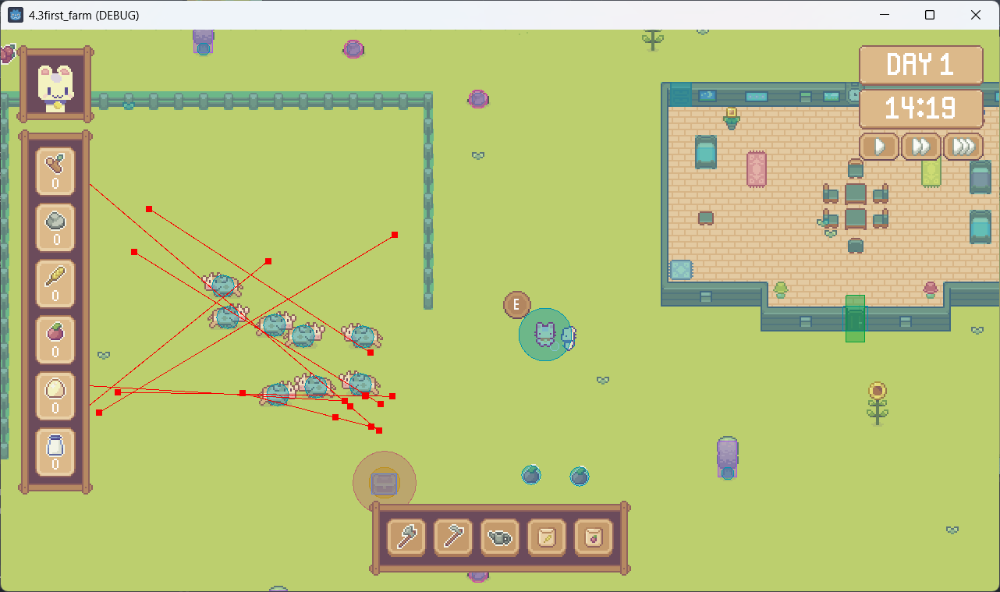

# 4.3first_farm

基于 Godot 4.3 的 2D 农场模拟游戏。

## 简介

- **引擎**：Godot 4.3，Forward Plus 渲染
- **类型**：2D 农场模拟
- **功能**：种植（玉米、番茄）、畜牧（鸡、牛）、昼夜循环、工具系统、背包、存档、对话系统

### 核心玩法

- **工具**：斧头、锄地、浇水、种植玉米/番茄
- **种植**：作物生长阶段（种子 → 发芽 → 营养生长 → 繁殖 → 成熟 → 收获）
- **畜牧**：鸡、牛，可产出蛋、奶
- **交互**：宝箱、NPC 对话、门
- **昼夜循环**：时间系统与光照变化

### 操作

| 操作     | 按键         |
|----------|--------------|
| 移动     | WASD / 方向键 |
| 使用工具 | 鼠标左键     |
| 移除泥土 | Ctrl + 左键  |
| 释放工具 | 鼠标右键     |
| 对话     | E            |
| 游戏菜单 | Esc          |
| 存档     | P            |

## 运行

### 环境要求

- Godot 4.3 或兼容版本

### 启动方式

**方式一：Godot 编辑器**

1. 打开 Godot 4.3 编辑器
2. 导入项目，选择项目根目录下的 `project.godot`
3. 点击运行按钮（F5）或播放主场景

**方式二：命令行**

```bash
godot --path "项目路径"  # 打开项目
godot --path "项目路径" -e  # 编辑器模式
godot --path "项目路径"  # 直接运行
```

## 项目结构

```
4.3first_farm/
├── addons/                    # 插件
│   └── dialogue_manager/      # 对话系统插件
├── assets/                    # 资源
│   └── ui/                    # UI 资源、字体
├── audio/                     # 音频
│   ├── game_audio_bus_layout.tres
│   └── music/
├── dialogue/                  # 对话脚本
│   └── conversations/
├── resources/                 # 通用资源
├── scenes/                    # 场景
│   ├── character/             # 角色
│   │   ├── chicken/           # 鸡
│   │   ├── cow/               # 牛
│   │   ├── guide/             # 引导 NPC
│   │   └── player/            # 玩家
│   ├── components/            # 可复用组件
│   │   ├── audio_play_time_component
│   │   ├── collectable_component
│   │   ├── crops_cursor_component
│   │   ├── damage_component / hurt_component
│   │   ├── day_night_cycle_component
│   │   ├── feed_component
│   │   ├── field_cursor_component
│   │   ├── hit_component
│   │   ├── interactable_component
│   │   ├── mouse_cursor_component
│   │   └── save_level_data_component
│   ├── houses/                # 建筑
│   ├── levels/                # 关卡
│   │   └── level_1.tscn
│   ├── objects/               # 可交互物体
│   │   ├── chest/             # 宝箱
│   │   ├── plants/            # 作物（玉米、番茄）
│   │   ├── rocks/             # 石头
│   │   └── trees/             # 树木
│   ├── test/                  # 测试场景
│   └── ui/                    # 界面
│       ├── day_and_night_panel
│       ├── emotes_panel
│       ├── game_menu_screen
│       ├── inventory_panel
│       └── tools_panel
├── scripts/                   # 脚本
│   ├── global/                # 全局单例
│   │   ├── day_and_night_cycle_manager.gd
│   │   ├── game_dialogue_manager.gd
│   │   ├── game_manager.gd
│   │   ├── inventory_manager.gd
│   │   ├── save_game_manager.gd
│   │   ├── scene_manager.gd
│   │   └── tool_manager.gd
│   ├── state_machine/         # 状态机
│   │   ├── node_state.gd
│   │   └── node_state_machine.gd
│   ├── data_types.gd          # 枚举与数据类型
│   └── game_input_events.gd
├── TileSets/                  # 瓦片集
│   ├── game_tile_set.tres
│   └── house_tile_set.tres
├── icon.svg
└── project.godot
```

### 全局单例 (Autoload)

| 单例                    | 职责           |
|-------------------------|----------------|
| ToolManager             | 工具选择与管理 |
| InventoryManager        | 背包与物品     |
| DayAndNightCycleManager | 昼夜循环       |
| SaveGameManager         | 存档与读档     |
| DialogueManager         | 对话系统（插件）|
| GameDialogueManager     | 游戏内对话逻辑 |
| GameManager             | 游戏流程控制   |
| SceneManager            | 场景加载       |

